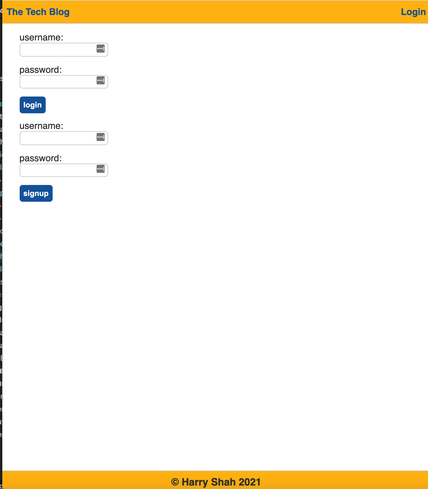
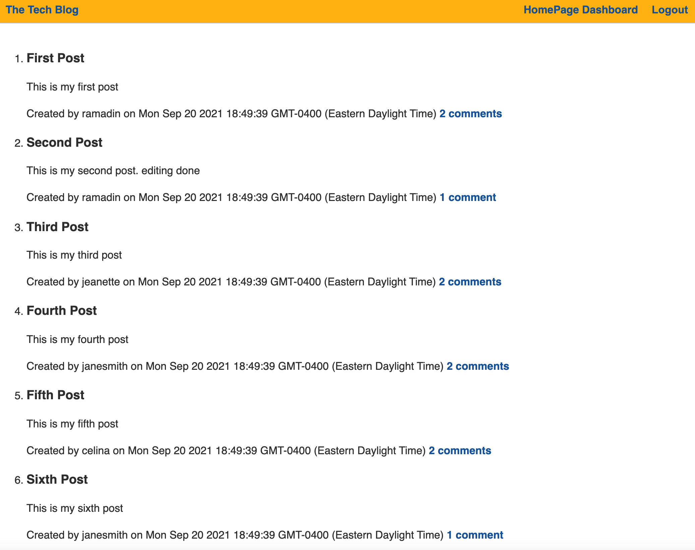

# the-tech-blog
# e-commerce-backend

## [Heroku Deployed App Url](https://harrys-tech-blog.herokuapp.com/)

## [GitHub Url](https://github.com/harry-100/e-commerce-backend)

## Description

This app is about tech blog where users can add or edit their blogs. Users need to register to create a blog or comment on the blogs created by others. Simply navigate to login page to get started. It uses express.js, mysql, hnadlebars and javaSCript/html/css. 

## Table of Contents

* [Usage](#Usage)
* [License](#License)
* [ScreenShots](#ScreenShots)
* [Questions](#Questions)

## Usage
This app is deployed on heroku. It can be invoked by clicking on the url provided above. 

## License
This application is covered under [MIT](
      https://opensource.org/licenses/MIT
      ) license.

## ScreenShots

## Questions
If you need more information, please checkout my [github account](https://github.com/harry-100). You can also reach me via [email](mailto:harvinder.shah@gmail.com?subject=the-tech-blog).